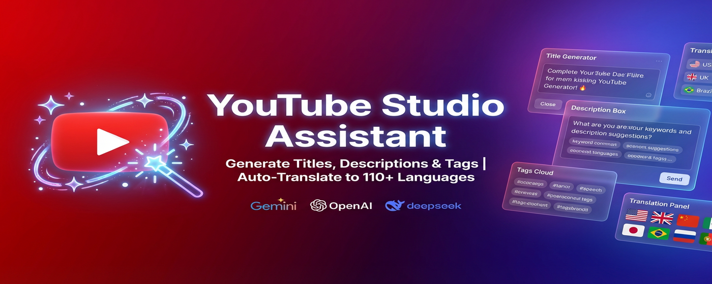
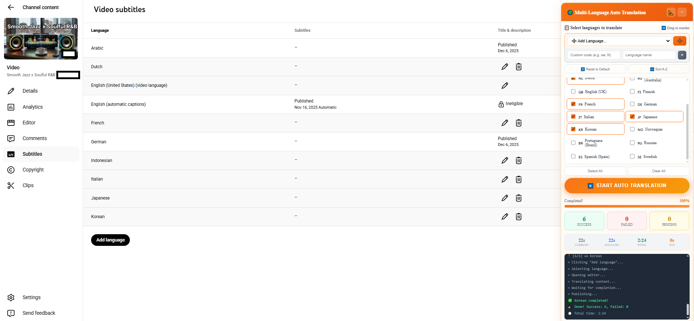

# YouTube Studio Assistant

  

  <strong>🚀 AI-Powered Content Generator & Auto-Translator for YouTube Creators</strong>

  <a href="https://bandioke.github.io/youtube-studio-assistant/">🌐 Website</a> •
  <a href="#features">✨ Features</a> •
  <a href="#installation">📦 Installation</a> •
  <a href="#screenshots">📸 Screenshots</a>

---

## ✨ Features

### 🤖 AI Content Generator
Generate viral titles, engaging descriptions, and SEO-optimized tags in seconds using:
- **Google Gemini** (Free!)
- **OpenAI GPT**
- **DeepSeek**

  

### 🌍 110+ Language Translation
Automatically translate your video metadata to over 110 languages with a single click.

  

### 🎨 Modern & Flexible UI
- Draggable panels
- Dark mode support
- Seamless YouTube Studio integration

  

---

## 📦 Installation

1. Download the extension from [https://www.aicreativs.com/](https://www.aicreativs.com/)
2. Or install manually:
   - Clone this repository
   - Go to `chrome://extensions/`
   - Enable "Developer mode"
   - Click "Load unpacked" and select the extension folder

---

## 📸 Screenshots

| Feature | Screenshot |
|---------|------------|
| Title Generator |  |
| Auto Translation |  |
| Multi-Language |  |
| Settings |  |

---

## 🔒 Privacy

We take your privacy seriously. This extension:
- ✅ Does NOT collect personal data
- ✅ Does NOT track your browsing
- ✅ Only accesses YouTube Studio pages
- ✅ API keys stored locally in your browser

Read our full [Privacy Policy](https://bandioke.github.io/youtube-studio-assistant/#/privacy-policy)

---

## 📧 Contact

- **Email:** hoybeecreativsdigital@gmail.com
- **GitHub:** [@bandioke](https://github.com/bandioke)
- **Website:** [bandioke.github.io/youtube-studio-assistant](https://bandioke.github.io/youtube-studio-assistant/)

---

## 📄 License

© 2025 PT. HOYBEE CREATIVS DIGITAL. All rights reserved.

---

  Made with ❤️ for YouTube Creators

